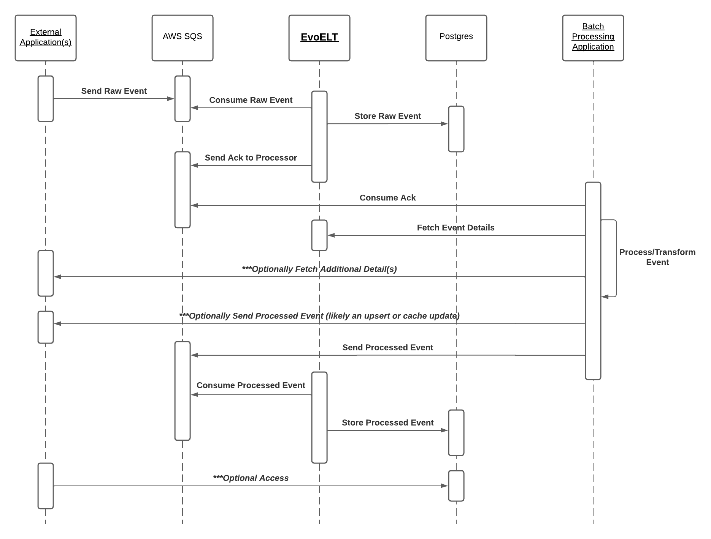

## About EvoELT
EvoELT seamlessly bridges raw and processed events from batched processing! It ensures that your ELT warehouse remains dynamic and adaptable whether you're aiming to retrospectively re-evaluate data, recognize intricate event patterns, learn from datasets, or enhance your event processing capabilities.

### Technical Overview
EvoELT is a flexible microservice designed to streamline the transfer of both a raw event, and its processed counterpart(s) into a database. Through AWS SQS (Amazon Simple Queue Service), it accommodates evolving transformations and processed versions. Historical transformations can be reprocessed and adjusted based on newer insights, all dependent on your batch processing application.

### Demo
[ELTsim](https://github.com/KenennaOkeke/ELTsim) is a repository with a basic use case; a recommended read.

## Table of Contents
- [About EvoELT](#about-evoelt)
- [Use Cases](#architecture-and-uses)
- [DB Schema](#db-schema)
- [Object Movement](#object-movement)
- [Requirements](#requirements)
- [Testing & Running Locally](#testing--running-locally)
- [Dockerization](#dockerization)

## Architecture and Uses
### Definitions
- Raw Event: Input information
- Raw Sequence: Input information grouped by label
- Processed Event: Output information
- Processed Sequence: Output information grouped by label

*Therefore, a single raw event may have multiple processed events.*

### High Level Architecture
Assume the following raw events are sent (A, AB, ABC, ABCD) and the following processed events received (A, BA, CBA, DCBA). Deep learning may identify or learn the reverse string count pattern (XYZ -> ZYX) without having access to the event processing application. Once a pattern has been recognised, potential anomalies can be detected. This would allow for a correction later on, since maybe instead of receiving DCBA, ZYWX should have been received.

### Medium Level Architecture
- Each raw event represents a user:score:game_session_number relationship.
- After submitting raw events to EvoELT (via the user:score:game_session_number relationship), EvoELT receives three transformations (mean, median, and mode) from the batch processing application.
- The processing application has access to a paginated list of previous plays (raw events) to generate statistics, which is later sent back to EvoELT as processed events.
- The use case could be a leaderboard, matchmaking system, etc.

### Low Level Architecture


The external application (service A) send an event with the labels `[user_id: 3, object_id: 5]` to EvoELT via message queue. EvoELT stores the data/labels (grouped by label via a raw sequence) and lets the processing/transformation application (service B) know which `raw_event_id` to later fetch through a REST GET request (as two events may be sent at the same time, but a new transformation may be needed for each new event; accurately ordering historical events may be important). The processing application fetches the raw sequence of events including labels from EvoELT via a REST API call. The processing application sends the result with labels(optional) and `raw_event_id` back to EvoELT via message queue; each label differentiation sent will create a new processed sequence; a new processed event would also be created linked to the raw_event_id.

## DB Schema


## Object Movement
*data values will vary; these are examples with sample data to showcase structure*

### Raw Event -> Message Queue -> EvoELT
```json
{
  "labels": ["user_id-3", "instance_id-5"],
  "data": "ABCD"
}
```
Stored as a raw event, in a sequence based on label (must be an array, order does not matter)
***labels are optional

### EvoELT -> Message Queue -> Processing Application
```json
{
  "raw_event_id": "c87880c6-0506-49d1-a570-f50198f867fd",
  "raw_sequence_labels": ["user_id-3", "instance_id-5"]
}
```

### Processing Application -> REST API -> EvoELT
The transformation application should send a get request to EvoELT, for example:
```
http://evoelt/lookup/raw/sequence?raw_event_id=c87880c6-0506-49d1-a570-f50198f867fd
```
returns

```json
{
  "labels": [
    "user_id-3",
    "instance_id-5"
  ],
  "events": [
    {
      "id": "c87880c6-0506-49d1-a570-f50198f867fd",
      "data": "ABCD",
      "order_id": 4,
      "created_dt": "2021-00-00 00:00:00.000000 +00:00"
    },
    {
      "id": "45f1af40-5d75-4375-b9f5-fe6d40b0a01a",
      "data": "ABC",
      "order_id": 3,
      "created_dt": "2021-00-00 00:00:00.000000 +00:00"
    },
    {
      "id": "9f4d2074-7c2d-4ba9-8f20-6be01abd8c5e",
      "data": "AB",
      "order_id": 2,
      "created_dt": "2021-00-00 00:00:00.000000 +00:00"
    },
    {
      "id": "66873a44-cf8f-4156-8b54-dede2e6c116e",
      "data": "A",
      "order_id": 1,
      "created_dt": "2021-00-00 00:00:00.000000 +00:00"
    }
  ],
  "total_events": 4,
  "total_pages": 1,
  "pageable": {
    "page_offset": 0,
    "page_number": 0,
    "page_size": 100,
    "sort": "rawSequenceOrderId: DESC"
  }
}
```

The raw event and all predecessors in the raw sequence are returned.

Additional GET query parameters exist for pagination. The key is below:

| Parameter Name | json key    | Default Value |
|----------------|-------------|---------------|
| raw_event_id   |             |               |
| page           | page_number | 0             |
| size           | page_size   | 100           |

Use `total_pages` and `page_number` to paginate.

### Processing Application -> Message Queue -> EvoELT
```json
{
  "labels": ["user_id-3", "instance_id-5", "quarter-2", "year-2023", "transformation_application_version-5.0.1"],
  "raw_event_id": "c87880c6-0506-49d1-a570-f50198f867fd",
  "data": "DCBA"
}
```
Stored as a processed event in a sequence based on labels; same/different data can be stored with different labels.

## Requirements
- postgres
- AWS SQS Queues /w a dead-letter queue for the consumption queue
  - *A FIFO queue is recommended; the Standard SQS Queue is not recommended as duplicates may be sent, which may cause duplicate data.*

## Testing & Running Locally
Run the following commands, execute:
```
docker network create myNetwork
docker run -p 4566:4566 -d --env DEBUG=1 --env EAGER_SERVICE_LOADING=1 --network myNetwork --name localstack localstack/localstack:3.6.0
docker run -p 5432:5432 -d --env POSTGRES_PASSWORD=password --network myNetwork --name postgres postgres:16
```
Then setup:
- postgres:16
  - Populate the `evoelt` schema under the `postgres` database with SQL in `app/db/init.sql`
- localstack/localstack:3.6.0
  - CLI Commands:
    - `awslocal sqs create-queue --queue-name EVOELT_CONSUMER.fifo --attributes "FifoQueue=true"`
    - `awslocal sqs create-queue --queue-name EVOELT_PRODUCER.fifo --attributes "FifoQueue=true"`
    - `awslocal sqs create-queue --queue-name dead-letter-queue`
    - `awslocal sqs set-queue-attributes --queue-url http://sqs.us-east-1.localhost.localstack.cloud:4566/000000000000/EVOELT_CONSUMER.fifo --attributes '{"RedrivePolicy": "{\"deadLetterTargetArn\":\"arn:aws:sqs:us-east-1:000000000000:dead-letter-queue\",\"maxReceiveCount\":\"1\"}"}'`

Now local runs and tests will work.

## Dockerization
```
gradle bootBuildImage
docker run -d -p 8080:8080 --env DB_URL --env QUEUE_ENDPOINT=http://localstack:4566 --env DB_URL=jdbc:postgresql://postgres:5432/postgres --env AWS_ACCESS_KEY_ID=sample --env AWS_SECRET_ACCESS_KEY=test --env AWS_REGION=us-east-1 --network myNetwork --name=evoelt org.kenenna/evoelt:latest
```
### Environment Variables

| Variable             | Description                   | Default        | Required |
|----------------------|-------------------------------|----------------|----------|
| `DB_URL`             | Database URL                  | jdbc:postgresql://localhost:5432/postgres             | Yes      |
| `DB_SCHEMA`          | Database Schema               | evoelt             | Yes      |
| `DB_USERNAME`        | Database user                 | postgres             | Yes      |
| `DB_PASSWORD`        | Database password             | password             | Yes      |
| `QUEUE_ENDPOINT`     | Message Queue Endpoint        | http://localhost:4566             | Yes      |
| `CONSUMER_QUEUE_URL` | Message queue for listening | EVOELT_CONSUMER.fifo             | Yes      |
| `PRODUCER_QUEUE_URL` | Message queue for sending ack | EVOELT_PRODUCER.fifo             | Yes      |
| `AWS_ACCESS_KEY_ID` |  |              | Yes      |
| `AWS_SECRET_ACCESS_KEY` |  |              | Yes      |
| `AWS_REGION` |  |              | Yes      |