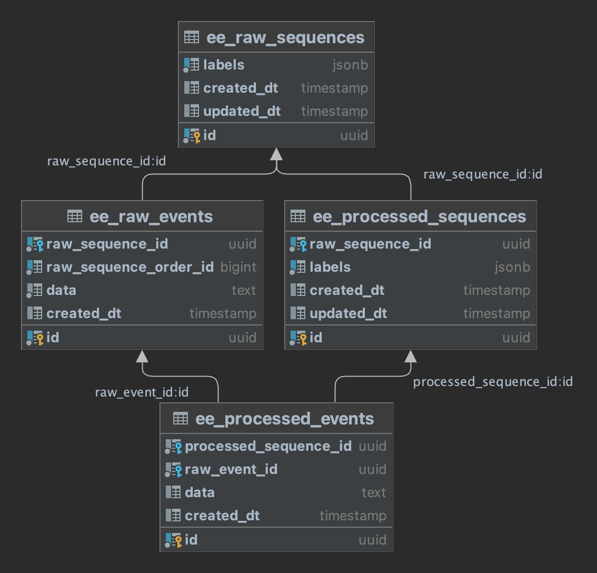

## About EvoELT

EvoELT is a tool designed to seamlessly bridge raw and transformed data. It not only accommodates real-time data changes and version history but also allows for a retrospective re-evaluation of data, empowering businesses to continuously refine their insights. Whether you're aiming to recognize intricate data patterns, refine your datasets, or simply enhance your data processing capabilities, EvoELT ensures that your ELT data warehouse remains dynamic, adaptable, and insightful.

### About EvoELT - technical version
EvoELT is a flexible microservice designed to streamline the transfer of both raw and transformed data into a data warehouse. By utilizing message queues, it accommodates evolving transformations and data versions. This ensures historical transformations can be reprocessed and adjusted based on newer insights.

## Table of Contents

- [About EvoELT](#about-evoelt)
  - [Technical About](#about-evoelt---technical-version)
- [Project Status](#project-status)
- [Use cases EvoELT enables](#use-cases-evoelt-enables)
- [Running EvoELT](#running-evoelt)
  - [Requirements](#requirements)
  - [Environment Variables](#environment-variables)
- [Implementing EvoELT](#implementing-evoelt)
  - [Definitions](#definitions)
  - [Process](#process)
- [DB Schema](#db-schema)
- [Objects Schema](#objects-schema)
- [Feedback and Support](#feedback-and-support)
- [Contributing](#contributing)
- [Roadmap](#roadmap)
- [License](#license)


## Project Status
**Current Status:** Pre-development

EvoELT is currently in the planning and design phase. The codebase has not been initiated yet. Keep an eye on this repository for updates on the development progress. Feedback at this stage is highly valuable as it can shape the future direction of the project.

## Use cases EvoELT enables
- **Pattern Recognition**
  - Detect outliers and make predictions.

- **Anomaly Detection & Data Refinement**
  - Understand past anomalies to improve future data transformations.

- **Data Tagging**
  - Label data for efficient categorization and retrieval.

- **Reprocessing Transformations**
  - Gain new insights from old data.


Simplified example use case: Assume we have the following raw items (A, AB, ABC, ABCD) and the following transformed items (A, BA, CBA, DCBA). With deep learning we can identify or learn the reverse string count pattern (XYZ -> ZYX) without having access to the transformation application. Once the pattern has been recognised, we can detect potential anomalies and later reprocess raw data as the transformation application evolves.

## Running EvoELT

Clone and build locally, or use the container available on Docker Hub: `docker pull kenennaokeke/evoelt:latest`

### Requirements
- **Database (select from below)**
  - postgres
- **Message Queue (select from below)**
  - AWS SQS (standard)

### Environment Variables

| Variable                | Description                                         | Default        | Required |
|-------------------------|-----------------------------------------------------|----------------|----------|
| `EE_DB_HOST`            | The database's hostname                             | --             | Yes      |
| `EE_DB_NAME`            | The database's name                                 | --             | Yes      |
| `EE_DB_USER`            | The database user                                   | --             | Yes      |
| `EE_DB_PASSWORD`        | The database user's password                        | --             | Yes      |
| `EE_MQ_CONSUMER_NAME`   | The name of the message queue to listen to          | --             | Yes      |
| `EE_MQ_PRODUCER_NAMES`  | Names of the message queues to send messages to     | --             | Yes      |
| `EE_DB_TABLE_PREFIX`    | The database tables prefix                          | `ee_`          | No       |
| `EE_DB_DRIVER`          | The database type                                   | `postgres`     | No       |
| `EE_MQ_CONSUMER_DRIVER` | The message queue type                              | `SQS`          | No       |
| `EE_MQ_PRODUCER_DRIVER` | The message queue type                              | `SQS`          | No       |

*`EE_MQ_PRODUCER_NAMES` - if multiple producers, separate them by a semicolon (`;`) without a backslash escape (`\ `) before the semicolon (`;`). If any of the producer names contain a semicolon, add a backslash before the semicolon: `\;`*

## Implementing EvoELT

### Definitions
- Item: Each unique data:label combination
- Collection: All items grouped by label
- Raw: Information before transformation
- Transformed: Information after transformation

### Process


The extraction application (your service) sends data to be transformed with labels (Example: `[user_id: 3, object_id: 5]`) to EvoELT via message queue. EvoELT stores the data/labels in the data warehouse (grouped by the label) and lets your transformation applications (your service(s)) know which `raw_item_id` to later lookup via message queue (as two items may be added almost at the same time, but we want a different transformations for each). The transformation application fetches the raw collection of items including labels from EvoELT via a REST API call. The transformation application sends the transformation result with labels and `raw_item_id` back to EvoELT via message queue. EvoELT stores the information from the message queue. The transformation application can also interact with your own service/application to store/update the transformation result by reading the labels returned in the EvoELT fetch request previously mentioned.

*If using a Standard SQS Queue, each application that handles transformation should have a lock on `raw_item_id` as SQS may send more than one message (duplicate) to your consumer.*

## DB Schema


## Objects Schema
*data values will vary; these are examples with dummy data to showcase structure*

### Raw Data -> Message Queue -> EvoELT
```json
{
  "labels": {"user_id": 3, "instance_id": 5},
  "data": "ABCD"
}
```
Stored as a raw item

### EvoELT -> Message Queue -> Transformation Application
```json
{
  "raw_item_id": "c87880c6-0506-49d1-a570-f50198f867fd",
  "raw_item_labels": {"user_id": 3, "instance_id": 5}
}
```

### Transformation Application -> REST API -> EvoELT
The transformation application should send a get request to EvoELT, for example:
```
http://evoelt/api/v1/raw/collection/lookup?raw_item_id=c87880c6-0506-49d1-a570-f50198f867fd
```
returns
```json
{
  "raw_collection": {
    "labels": {"user_id": 3, "instance_id": 5},
    "items": [
      {
        "raw_item_id": "66873a44-cf8f-4156-8b54-dede2e6c116e",
        "data": "A"
      },
      {
        "raw_item_id": "9f4d2074-7c2d-4ba9-8f20-6be01abd8c5e",
        "data": "AB"
      },
      {
        "raw_item_id": "45f1af40-5d75-4375-b9f5-fe6d40b0a01a",
        "data": "ABC"
      },
      {
        "raw_item_id": "c87880c6-0506-49d1-a570-f50198f867fd",
        "data": "ABCD"
      }
    ]
  }
}
```

### Transformation Application -> Message Queue -> EvoELT
```json
{
  "labels": {"user_id": 3, "instance_id": 5, "quarter": 2, "year": 2023, "transformation_application_version":  "5.0.1"},
  "raw_item_id": "c87880c6-0506-49d1-a570-f50198f867fd",
  "data": "DCBA"
}
```
Stored as a transformed item

## Feedback and Support
We value your feedback and aim to provide the best experience for our users. If you encounter any issues, have suggestions, or need assistance:
- **Issues & Bug Reports**: If you find a bug or come across any issues, please check the [GitHub issue tracker](https://github.com/KenennaOkeke/EvoELT/issues?labels=bug&template=bug.md&title=) to see if it has already been reported, if not [open a new bug issue](https://github.com/KenennaOkeke/EvoELT/issues/new?labels=bug&template=bug.md&title=) to report them.
- **Feature Requests**: Have a feature in mind? Please [open a new feature request issue](https://github.com/KenennaOkeke/EvoELT/issues/new?labels=enhancement&template=feature_request.md&title=) with the label 'enhancement'.
- **Questions & Discussions**: For general questions, use the [discussions tab](https://github.com/KenennaOkeke/EvoELT/discussions) on GitHub.

For other inquiries or private concerns, feel free to email the project maintainer at [github@kenenna.com](mailto:github@kenenna.com)

## Contributing
We welcome contributions!
<!-- Please see the [CONTRIBUTING](CONTRIBUTING.md) file for details on how to get started, and the [Code of Conduct](CODE_OF_CONDUCT.md) for community guidelines.-->

## Roadmap
- Allow for all message queue consumption processes to be possible via REST APIs
- Flag to enable logging of upserts (reprocessing) in the database

## License
EvoELT is open-sourced software licensed under the [MIT License](LICENSE).